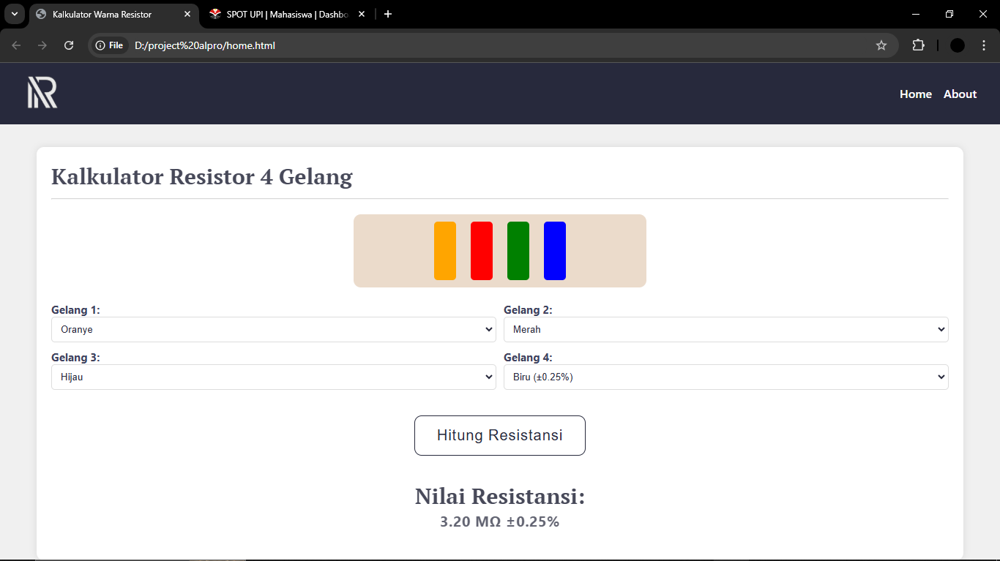

[](https://opensource.org/licenses/MIT)
<!-- PROJECT LOGO -->
<br />
<div align="center">
  <a href="[https://github.com/othneildrew/Best-README-Template](https://github.com/mjhoncaryy/terakhir-asli/blob/main/logo.png)">
    
  </a>
  <h1 align="center">Resiscolor</h1>
  <h3 align="center"><strong>Decode Resistance Instantly</strong></h3>
</div>

<!-- ABOUT THE PROJECT -->
## About This Project
</img>
Kalkulator Warna Resistor 4 Gelang adalah sebuah alat online yang berguna bagi para teknisi maupun non-teknisi untuk mengidentifikasi nilai resistansi suatu resistor. Website ini menyajikan antarmuka yang sederhana dan intuitif, membuat pengguna mudah untuk menentukan nilai resistansi dan toleransi hanya dengan mencocokkan warna-warna tertentu pada resistor. Tujuan utama dari website ini adalah mempermudah proses pembacaan kode warna resistor yang seringkali membingungkan, terutama bagi pemula di bidang elektronika. Dengan fitur interaktif yang memungkinkan pengguna memilih warna gelang secara manual atau menggunakan panduan visual.

## Built With
Dalam pengembangan website kalkulator warna resistor ini, kami menggunakan beberapa bahasa pemrograman, yaitu:

* 
* 
* 

## Features
* Menghitung Nilai Resistansi Resistor
* Menampilkan Nilai Toleransi Resistor
* Tujuan dan Manfaat Website
* Kontak Pembuat Website

<!-- GETTING STARTED -->
## Installation
Langkah-langkah untuk menginstall program ini secara lokal

1. Pilih folder yang akan menjadi repository program. 
2. Clone repo
  ```sh
  git clone https://github.com/mjhoncaryy/terakhir-asli.git
  ```
<!-- USAGE EXAMPLES -->
## Usage
Berikut panduan cara menggunakan website:
1. Pilih warna gelang pertama sampai gelang keempat.
2. Klik tombol "Hitung Resistansi".
3. Nilai resistansi beserta nilai toleransi akan muncul.
<!-- LICENSE -->
## License
Proyek ini dikembangkan dibawah lisensi MIT. Lihat `LICENSE` untuk info lebih lanjut.
<!-- CONTACT -->
## Contact
* Team Resiscolor - timresiscolor@gmail.com
* Project Link: [https://github.com/mjhoncaryy/terakhir-asli](https://github.com/mjhoncaryy/terakhir-asli)
